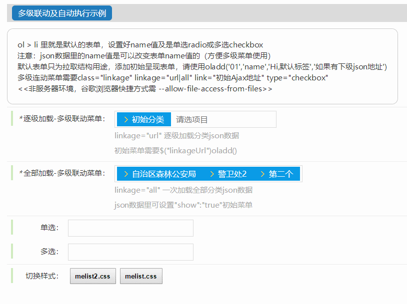

# melist多级联动下拉菜单

[演示1](https://flashmecn.github.io/melist/melist%E5%A4%9A%E7%BA%A7%E8%81%94%E5%8A%A8%E4%B8%8B%E6%8B%89%E8%8F%9C%E5%8D%95/demo.html)
|
[演示2](https://flashmecn.github.io/melist/melist%E5%A4%9A%E7%BA%A7%E8%81%94%E5%8A%A8%E4%B8%8B%E6%8B%89%E8%8F%9C%E5%8D%95/demo2.html)

**树状菜单的使用** 
[树状菜单](https://flashmecn.github.io/melist/melist%E5%A4%9A%E7%BA%A7%E8%81%94%E5%8A%A8%E4%B8%8B%E6%8B%89%E8%8F%9C%E5%8D%95/tree.html)

#### 介绍
多级联动下拉菜单，也可单选可多选，支持中英文混合检索，
使用了jQuery.Hz2Py，支持拼音检索中文

#### 使用说明

必要文件：
jquery.js、
melist.css、
jQuery.Hz2Py-min.js、
melist.js

 **melist();//初始化** 
> 如果是json地址读取，class="soso"填写data-link="json地址"

 **linkageall(); //有json数据地址前提下直接执行** 

#### 参与贡献

1. 夕空

#### Web
[www.flashme.cn](http://www.flashme.cn)
